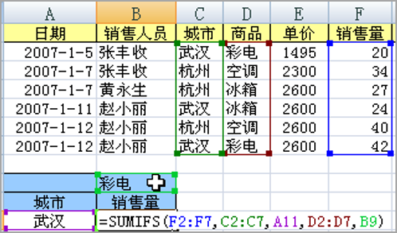
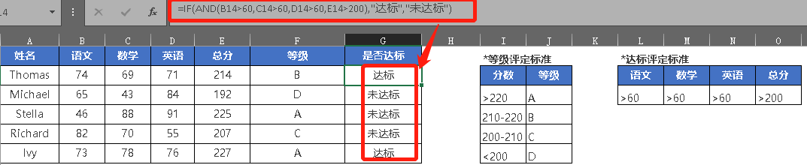
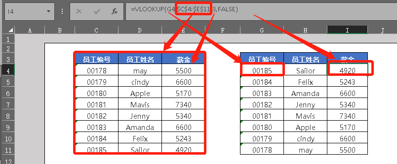

[TOC]

# Excel函数及公式

## Excel函数

### 基础函数

[AVERAGEIF函数详解可查看此链接](http://www.liangshunet.com/ca/201812/817295210.htm)

```bash
SUM(C19:C21)
# 指定单个条件求和
SUMIF(range,criteria,sum_range)
SUMIF(D17:D20,"MP3",D17:D20)
# 指定多个条件求和，见下图
SUMIFS(sum_range,criteria_range1,criteria1,criteria_range2,criteria2…)
SUMIFS(F2:F7,C2:C7,A11,D2:D7,B9)
SUMIFS(E:E,C:C,G10,D:D,H10)

# 满足某个条件的平均分
# 注意存在空值情况无法计算
AVERAGEIF(D:D,H15,F:F)
# 四舍五入保留两位小数
ROUND(number,num_digits)
ROUND(AVERAGEIF(D:D,H15,F:F),2)

MAX(A2:A6)
MIN(A2:A6)
```


### 统计函数

```bash
# 计算包含数字的个数
COUNT(D2:D31)

# 计算包含数字或文本的个数
COUNTA(D2:D31)

# 计算空单元格的个数
COUNTBLANK(D2:D31)

# 计算满足单个条件的个数，*多个字符，？单个字符
COUNTIF(range,criteria)
COUNTIF(D2:D31,H2)
COUNTIF(D:D,I9)
COUNTIF(A:A,"赵*")

# 计算满足多个条件的个数
COUNTIFS(range1, criteria1,range2, criteria2…)
```

### 逻辑类

```bash
# 单条件
IF(logical_test,value_if_true,value_if_false)
IF(F4>=$J$1,"达标","未达标")
# 多条件
IF(E15>220,$J$15,IF(E15>=210,$J$16,IF(E15>200,$J$17,$J$18)))

# 同时满足多个条件
AND(logical1,logical2, ...)
IF(AND(B15>60,C15>60,D15>60,E15>200),"达标","未达标")
```



### 查找/引用类

```bash
# Range_lookup False精确匹配/TRUE或省略，则返回近似匹配值
# Table_array 为要查找数据的数据表
# Col_index_num 为 table_array 中待返回的匹配值的列序号
VLOOKUP(lookup_value,table_array,col_index_num,range_lookup)
# 精确匹配
VLOOKUP(G6,$C$4:$E$11,3,FALSE)
# 近似匹配
VLOOKUP(E15,$H$15:$I$18,2,TRUE)

# Reference 对一个或多个单元格区域的引用； 
# Row_num 引用中某行的行序号
# Column_num 引用中某列的列序号
# Area_num 选择引用中的一个区域，并返回该区域中 row_num 和 column_num 的交叉区域
INDEX(reference,row_num,column_num,area_num)

# 
OFFSET(reference,rows,cols,height,width)
```



### 日期类函数

[关于身份证号日期函数查看此链接](https://zhuanlan.zhihu.com/p/32908833)

```bash
# 从身份中截取出生日期
TEXT(MID(E2,7,8),"00-00-00")

# 根据身份证号显示性别
IF(MOD(MID(E2,17,1),2),"男","女")

# 计算年龄
YEAR(TODAY())-MID(E2,7,4)
```

### 文本类函数

```bash
# 检查两个文本值是否相同
exact（A2，B2）

# 基于所指定的字符数返回文本字符串中的第一个或前几个字符
LEFT(text,num_chars)
LEFT(C13,4)

# 根据所指定的字符数返回文本字符串中最后一个或多个字符
RIGHT(text,num_chars)

# 返回文本字符串中从指定位置开始的特定数目的字符，该数目由用户指定
MID(text,start_num,num_chars)

# 返回文本字符串中的字符数
LEN(text)
```

## Excel公式

> 任何公式的创建，都是以等号“=”开始，系统将“=”号后面的字符串识别为公式。

### 1、运算符介绍

- 算术运算符：加“+”、减“-”、乘“*”、除“/”、乘方“^”
- 比较运算符：等于”=”、大于”>”、小于”<”、大于或者等于”>=”、小于或者等于”<=”、不等于”<>”
- 文本运算符：“&”
- 引用运算符：冒号、逗号

> 优先级：算术运算符→&(字符连接)→比较运算符

### 2、相对引用/绝对引用

- 相对引用：在单元格中引用一个或多个相对地址的单元格。
- 绝对引用：在单元格中引用一个或多个特定位置的单元格，绝对引用在行号列标前加“$”。

> 光标定位到表示单元格引用的字符上，重复按F4键将依次在绝对、行绝对、列绝对和相对引用间进行循环切换。

